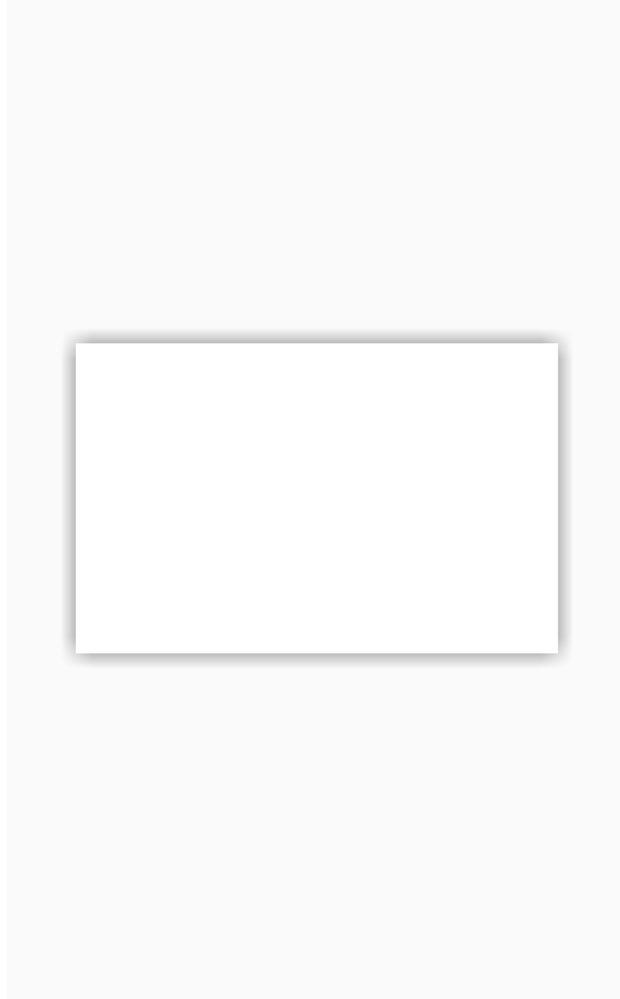

Shadow
=================

overview
-----

in AndroJet each element can have a shadow. The following code shows an example of shadow of an Image View:
``` sass
image{
    src:"@drawable/picturex"
    shadow{
        opacity: 40
        radius: 5dp
    }
}
```
All attributes are listed in the table below:

| Properties    | description                                           | Default value     
| ------------- | ------------------------------------------            | --------------     
| x             | The amount of displacement on the x-axis              | 2dp           
| y             | The amount of displacement on the y-axis              | 2dp           
| opacity       | The opacity of shadow in percent (between 0-100)      | 30 
| radius        | determine the amount of blur                          | 5dp           

Notes:

- shadow color is Black and White only
- you can use <b>color</b> instead of <b>opacity</b> but note color 
- `shadow` support `TextView` as well
    - `shadow` for a text can have color other than black

Example
-----

=== "Simple Shadow"
    simple activity with one `FramLayout` and `View` to show a rectangle with shadow.


    

    ``` sass hl_lines="11 12 13 14"
    activity {
      name: "Nino"
      frame{
        w:mp
        h:mp
        view{
          align: c
          w: 300dp
          h: 200dp
          background: #ffffff
          shadow-x: 0dp
          shadow-y: 0dp
          shadow-opacity: 50
          shadow-radius: 10dp
        }
      }
    }
    ```


=== "Rounded Shadow"
    this sample shows rounded shadow. when using `border-radius` attribute `shadow` and  `background` will be rounded.


    

    ``` sass hl_lines="18 19 20 21 22"
    activity {
      name: "Nino"
      frame{
        w:mp
        h:mp
        background: #FFFFFF
        text{
          text: "Continue"
          size: 25dp
          align: c
          color: #949BA0
        }
        view{
          align: c
          w: 300dp
          h: 80dp
          background: #FFFFFF
          shadow-x : 0dp
          shadow-y : 3dp
          shadow-opacity : 30
          shadow-radius : 5dp
          border-radius: 30dp
          
        }
      }
    }
    ```
